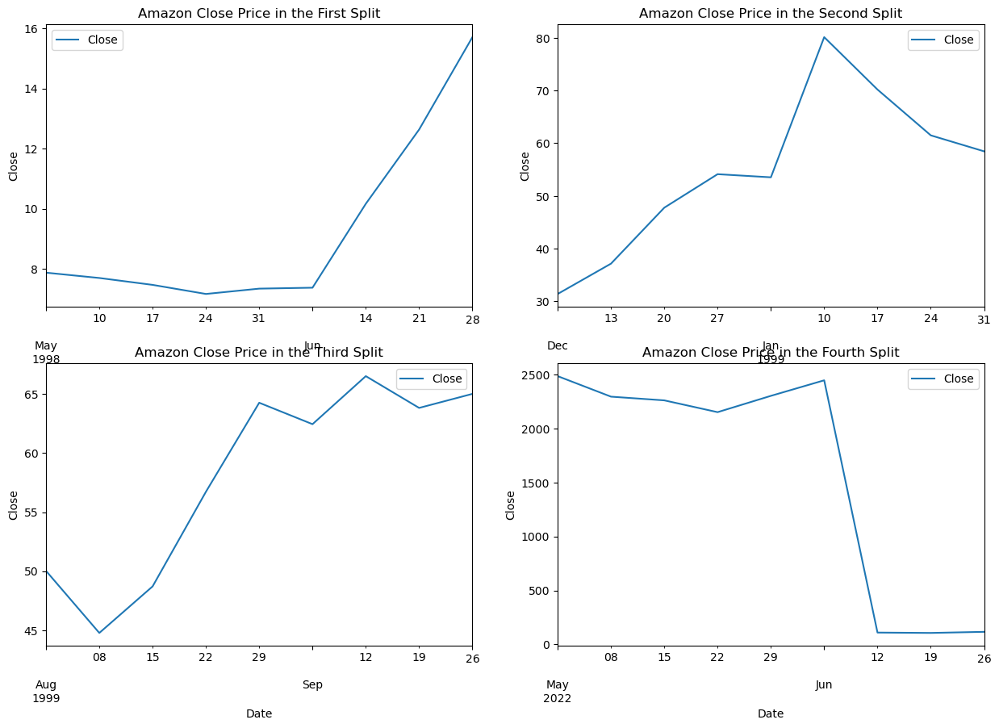

# EUKLID AI Systematic Trading Challenge

**Team Members:** Andrea Marcoccia, Leonardo Pulicati, Francesco Del Treste

## [Section 1] Introduction

The project aims to design and develop an AI-driven systematic trading model that can navigate the intricacies of financial markets with precision and agility. By harnessing the power of this dataset, the model will identify patterns, predict market movements, and execute trades to capitalize on these insights, all while managing risk and maximizing returns.

The datasets include 3 indices and 3 stocks: S&P500, Nasdaq, CAC, Microsoft, IBM, and Amazon, with the following data:

- **Date/Time Stamp:** Each record is associated with a specific week, allowing for temporal analysis of financial metrics over time.
- **OHLC Prices:** Provides the opening price, highest price, lowest price, and closing price of a stock or index for the week, crucial for understanding market trends and volatility.
- **Volume:** Indicates the total number of shares or contracts traded for the stock or index during the week, reflecting the level of activity and liquidity.

## [Section 2] Methods

### Pre-Processing

#### Missing Values

Indices had missing records for 2 weeks, which we handled through imputation:

- **Open price** is typically equal to or similar to the close price of the previous week:
  - We imputed the **close price of 2023-05-21** with the open price of 2023-05-28, and the **open price of 2023-05-14** with the close price of 2023-05-07 with high confidence.
  - The **2023-05-14 close price and 2023-05-21 open price** were reasonably imputed as the mean between the 2023-05-14 open and 2023-05-21 close.

- **High and Low prices** were imputed as follows:
  - The **greater between the open and close prices** was taken as the high price.
  - The **lower between the open and close prices** was taken as the low price.

- **Volume** was imputed as the **mean volume of the year**, based on the distribution of volume over the last 5 years.

The second issue addressed in pre-processing is **stock splits**. While IBM and Microsoft data were already adjusted for stock splits, Amazon's data did not account for a recent split, which was corrected.

   
   

#### Additional Columns for Model Training and Evaluation

We computed two columns useful for the training and evaluation of our models:

- **Market direction:** Indicates if the price went up or down compared to the previous week. This helps evaluate the success of our trading choices.

- **Trading strategy:** Either -1 (short), 0 (exit), or 1 (long). This represents the trading choice we try to predict with our models. A moderate approach is used for trade signals, with a percentage change threshold for going long or short to exit the market approximately 30% of the time. This way, when the percentage change is minimal compared to the previous week, no trade signal is generated. This signal serves as the output value to predict with our models.
  
#### Indicators

Several indicators were computed for use in the models as predictors:

- **SMA and EMA (14 Weeks):** Targets medium-term trends, reflecting quarterly performance, crucial for understanding market dynamics over significant financial periods.
- **Stochastic Oscillator (Default: 14):** Spots overbought or oversold conditions, important for predicting potential price reversals on a medium-term basis.
- **RSI (14 Weeks):** Evaluates medium-term market momentum, useful in identifying overbought or oversold conditions over a quarter.
- **MACD (14 weeks):** Detects changes in medium-term trend strength and direction, offering signals for potential trading opportunities.
- **Hurst Coefficient:** Indicates the behavior of time series:
  - H < 0.5: Tends to revert to a mean, suggesting that increases will likely be followed by decreases and vice versa.
  - H = 0.5: Future price movements are completely independent of past movements.

Finally, we standardized the data and used a 90-10 split for training and testing.

### Models

#### ARIMA
The first model is ARIMA, the only regression model used. This model uses the close price as its sole predictor to forecast the next occurrence.

To choose its parameters, an automated tool its used:
- The `auto.arima()` function selects the best `p`, `d`, and `q` parameters based on AIC/BIC values.

Once the ARIMA model's prediction is made, trading strategy is defined in this way:
- If the prediction of the next close is greater than the previous close by a certain threshold, we go long.
- If the prediction of the next close is smaller than the previous close by a certain threshold, we go short.
- If it remains on the threshold interval we exit the market because we are not confident to make a trading choice.

#### LSTM 

The second model is LSTM:
- This model takes a window of 60 weeks of data about prices, indicators, volume, etc., and directly predicts the trading choice as -1, 0, or 1.
- The LSTM consists of two layers:
  - A recurrent layer with 10 units followed by another recurrent layer with 5 units, to process sequential data.
  - Dense layers of 64 and 32 units that apply a nonlinear transformation, refining the output.
  - A final output layer that produces a prediction based on a softmax activation, outputting probabilities for -1, 0, or 1.

- Compilation details:
  - The model is optimized using the Adam optimizer, balancing learning rate and convergence speed.
  - Categorical cross-entropy is used as the loss function, as it handles multi-class classification well.
  - Training includes metrics for accuracy tracking.

- A basic, small structure was chosen:
  - A larger structure offered no advantage.
  - Few epochs were used to train the model to avoid overfitting, as it stops learning beyond this point.

#### SVM

The SVM model takes a window of 10 weeks of data about prices, indicators, volume, etc., and directly predicts the trading choice as -1, 0, or 1.

The model's parameters were chosen based on a grid search for each of our stocks and indices, ensuring the best-performing models for each case. The grid search explored various combinations of parameters, including:

- **Kernel:** Different types of kernels (linear, rbf, poly, and sigmoid) to find the best decision boundary for classification.
- **C:** A range of regularization values to balance bias and variance.
- **Degree:** For polynomial kernels, to determine the complexity of the decision boundary.
- **Gamma:** For rbf and poly kernels, to set the scale for the input features.

After training, the SVM classifies new inputs based on the selected kernel and learned boundaries, directly predicting the trading signal.

#### Random Forest

The Random Forest model is an ensemble model that takes as input the different models (ARIMA, LSTM, and SVM) and outputs a trading choice based on their combined predictions. The idea is to gather the opinion of different "traders" (represented by our models) and make a decision by listening to all of them.

The model's parameters were chosen based on a grid search, exploring various combinations, including:

- **n_estimators:** The number of trees in the forest, tested with values of 30, 50, and 100.
- **max_depth:** The maximum depth of each tree, explored with values of 10, 20, and None.
- **min_samples_split:** The minimum number of samples required to split a node, tested with values of 2, 5, and 10.
- **min_samples_leaf:** The minimum number of samples required in a leaf node, explored with values of 1, 5, and 10.
- **max_features:** The number of features to consider for splitting a node, tested with 'sqrt' and None.

After the grid search, the best-performing model is chosen, combining the predictions from all models to classify the trading signal directly.
