# EUKLID AI Systematic Trading Challenge

**Team Members:** Andrea Marcoccia 775451, Leonardo Pulicati 786931, Francesco Del Treste 783351

## [Section 1] Introduction

The project aims to design and develop an AI-driven systematic trading model that can navigate the intricacies of financial markets with precision and agility. By harnessing the power of this dataset, the model will identify patterns, predict market movements, and execute trades to capitalize on these insights, all while managing risk and maximizing returns.

The datasets include 3 indices and 3 stocks: S&P500, Nasdaq, CAC, Microsoft, IBM, and Amazon, with the following data:

- **Date/Time Stamp:** Each record is associated with a specific week, allowing for temporal analysis of financial metrics over time.
- **OHLC Prices:** Provides the opening price, highest price, lowest price, and closing price of a stock or index for the week, crucial for understanding market trends and volatility.
- **Volume:** Indicates the total number of shares or contracts traded for the stock or index during the week, reflecting the level of activity and liquidity.

## [Section 2] Methods

### Pre-Processing

#### Missing Values

   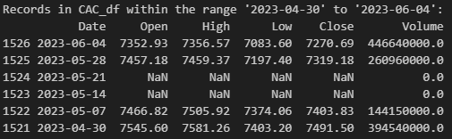
   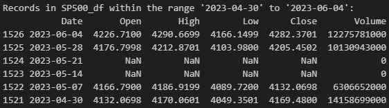
   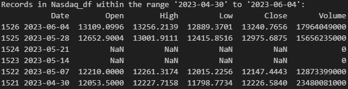

Indices had missing records for 2 weeks, which we handled through imputation:

- **Open price** is typically equal to or similar to the close price of the previous week:
  - We imputed the **close price of 2023-05-21** with the open price of 2023-05-28, and the **open price of 2023-05-14** with the close price of 2023-05-07 with high confidence.
  - The **2023-05-14 close price and 2023-05-21 open price** were reasonably imputed as the mean between the 2023-05-14 open and 2023-05-21 close.

- **High and Low prices** were imputed as follows:
  - The **greater between the open and close prices** was taken as the high price.
  - The **lower between the open and close prices** was taken as the low price.

- **Volume** was imputed as the **mean volume of the year**, based on the distribution of volume over the last 5 years.

The second issue addressed in pre-processing is **stock splits**. While IBM and Microsoft data were already adjusted for stock splits, Amazon's data did not account for a recent split, which was corrected.

   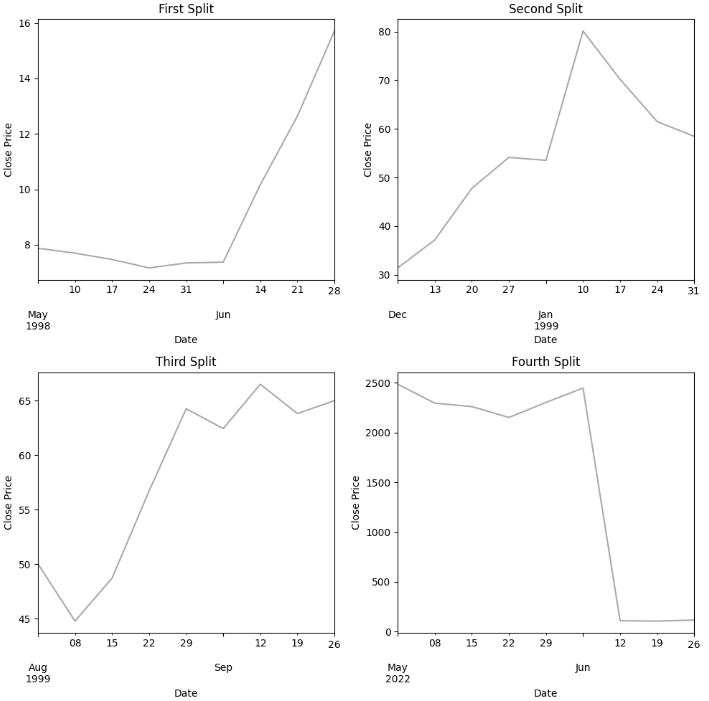
   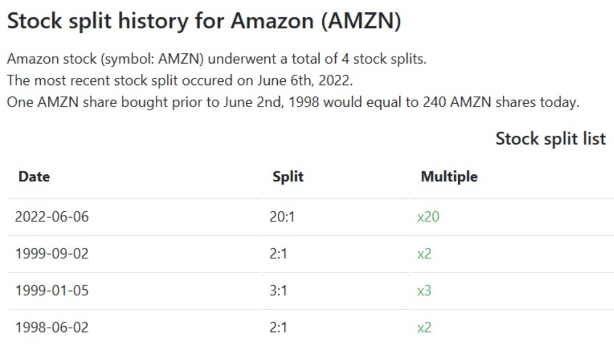 

#### Additional Columns for Model Training and Evaluation

We computed two columns useful for the training and evaluation of our models:

- **Market direction:** Indicates if the price went up or down compared to the previous week. This helps evaluate the success of our trading choices.

- **Trading strategy:** Either -1 (short), 0 (exit), or 1 (long). This represents the trading choice we try to predict with our models. A moderate approach is used for trade signals, with a percentage change threshold for going long or short to exit the market approximately 30% of the time. This way, when the percentage change is minimal compared to the previous week, no trade signal is generated. This signal serves as the output value to predict with our models.
  
#### Indicators

Several indicators were computed for use in the models as predictors:

- **SMA and EMA (14 Weeks):** Targets medium-term trends, reflecting quarterly performance, crucial for understanding market dynamics over significant financial periods.
- **Stochastic Oscillator (Default: 14):** Spots overbought or oversold conditions, important for predicting potential price reversals on a medium-term basis.
- **RSI (14 Weeks):** Evaluates medium-term market momentum, useful in identifying overbought or oversold conditions over a quarter.
- **MACD (14 weeks):** Detects changes in medium-term trend strength and direction, offering signals for potential trading opportunities.
- **Hurst Coefficient:** Indicates the behavior of time series:
  - H < 0.5: Tends to revert to a mean, suggesting that increases will likely be followed by decreases and vice versa.
  - H = 0.5: Future price movements are completely independent of past movements.
  - H > 0.5: The series that tends to follow a trend. This means that increases will likely follow increases, and decreases will likely follow decreases.

Finally, we standardized the data and used a 90-10 split for training and testing.

### Models

#### ARIMA
The first model is ARIMA, the only regression model used. This model uses the close price as its sole predictor to forecast the next occurrence.

To choose its parameters, an automated tool its used:
- The `auto.arima()` function selects the best `p`, `d`, and `q` parameters based on AIC/BIC values.

Once the ARIMA model's prediction is made, trading strategy is defined in this way:
- If the prediction of the next close is greater than the previous close by a certain threshold, we go long.
- If the prediction of the next close is smaller than the previous close by a certain threshold, we go short.
- If it remains on the threshold interval we exit the market because we are not confident to make a trading choice.

#### LSTM 

The second model is LSTM:
- This model takes a window of 60 weeks of data about prices, indicators, volume, etc., and directly predicts the trading choice as -1, 0, or 1.
- The LSTM consists of two layers:
  - A recurrent layer with 10 units followed by another recurrent layer with 5 units, to process sequential data.
  - Dense layers of 64 and 32 units that apply a nonlinear transformation, refining the output.
  - A final output layer that produces a prediction based on a softmax activation, outputting probabilities for -1, 0, or 1.

- Compilation details:
  - The model is optimized using the Adam optimizer, balancing learning rate and convergence speed.
  - Categorical cross-entropy is used as the loss function, as it handles multi-class classification well.
  - Training includes metrics for accuracy tracking.

- A basic, small structure was chosen:
  - A larger structure offered no advantage.
  - Few epochs were used to train the model to avoid overfitting, as it stops learning beyond this point.

#### SVM

The SVM model takes a window of 10 weeks of data about prices, indicators, volume, etc., and directly predicts the trading choice as -1, 0, or 1.

The model's parameters were chosen based on a grid search for each of our stocks and indices, ensuring the best-performing models for each case. The grid search explored various combinations of parameters, including:

- **Kernel:** Different types of kernels (linear, rbf, poly, and sigmoid) to find the best decision boundary for classification.
- **C:** A range of regularization values to balance bias and variance.
- **Degree:** For polynomial kernels, to determine the complexity of the decision boundary.
- **Gamma:** For rbf and poly kernels, to set the scale for the input features.

After training, the SVM classifies new inputs based on the selected kernel and learned boundaries, directly predicting the trading signal.

#### Random Forest

The Random Forest model is an ensemble model that takes as input the different models (ARIMA, LSTM, and SVM) and outputs a trading choice based on their combined predictions. The idea is to gather the opinion of different "traders" (represented by our models) and make a decision by listening to all of them.

The model's parameters were chosen based on a grid search, exploring various combinations, including:

- **n_estimators:** The number of trees in the forest, tested with values of 30, 50, and 100.
- **max_depth:** The maximum depth of each tree, explored with values of 10, 20, and None.
- **min_samples_split:** The minimum number of samples required to split a node, tested with values of 2, 5, and 10.
- **min_samples_leaf:** The minimum number of samples required in a leaf node, explored with values of 1, 5, and 10.
- **max_features:** The number of features to consider for splitting a node, tested with 'sqrt' and None.

After the grid search, the best-performing model is chosen, combining the predictions from all models to classify the trading signal directly.

## [Section 3] Experimental design

### Experiment 1

- **Main Purpose:** To evaluate the proposed model's performance on the different indices and stocks.

- **Evaluation Metric 1:** Accuracy.
  - Accuracy is a metric used to measure the proportion of correctly predicted outcomes by a model compared to the total number of instances evaluated. We used accuracy as it provides         a straightforward measure of overall model performance, crucial for assessing its effectiveness in predicting market movements. Since the goal of the project was to earn as much           as possible, we decide to exclude from the evalutation the times the models predict 0.

- **Evaluation Metric 2:** Confusion matrix.
  - It is a table that summarizes the performance of a model by presenting the counts of true positive, true negative, false positive, and false negative predictions, allowing for a           detailed analysis of the model's accuracy and error rates. We utilized the confusion matrix in addition to the accuracy to gain insights into the model's behaviour to wrongly (FP and      FN) classify instances and to identify specific areas for improvement in its predictive capabilities for different stocks and indices.

- **Evaluation Metric 3:** Receiver Operating Characteristic (ROC) curve
  - It is a graphical representation that illustrates the performance of a classification model across various thresholds. It plots the true positive rate (sensitivity) against the false      positive rate (1 - specificity) for different threshold values, providing insight into the model's ability to discriminate between classes and helping to determine the optimal             threshold for classification tasks. We used the ROC curve to assess the model's discriminatory power and its suitability for distinguishing between market movements, aiding in fine-tuning its threshold for decision-making. In particular, we applied this metric to have a intuitive visualization of the results for the LSTM and SVM models, since their outputs were directly the trading prediction.

- **Evaluation Metric 4:**  Classification report.
  - It is a comprehensive summary of the performance of a classification model. It includes metrics such as precision, recall, F1-score. Precision measures the proportion of true positive     predictions among all positive predictions, while recall measures the proportion of true positive predictions among all actual positives. The F1-score is the harmonic mean of              precision and recall, providing a balanced measure of a model's performance. The classification report offers detailed insights into the model's performance for individual classes,        aiding in understanding its strengths and weaknesses across different categories. The classification report facilitates a detailed analysis of the model's strengths and weaknesses         across different categories, guiding improvements in its predictive capabilities for various stocks and indices.

### Experiment 2

- **Main Purpose:** To benchmark the performance of the proposed models against a baseline model that predicts only 1.

- **Baseline:** The baseline model predicts a constant outcome equal to 1 for all instances.

- **Evaluation Metric:** Same metrics as previous experiment. 

## [Section 4] Results

### ARIMA

Considering the evaluation metrics and all the previous insights, we can estimate that the average accuracy is around 50% for the ARIMA model.
- **Amazon accuracy**: 0.52
- **CAC accuracy**: 0.50
- **IBM accuracy**: 0.52
- **Microsoft accuracy**: 0.45
- **SP500 accuracy**: 0.52
- **Nasdaq accuracy**: 0.52

ARIMA model shows to not be very good in predictions, this is pretty normal due to its high simplicity.
Taking the two confusion matrices of Amazon and CAC as an example, we can underline that for amazon the model predicts 54% of true positives (when the market goes long) and 49% true negatives (when the market goes short) , while for the CAC index it predicts 60% true positives and 41% true negatives. After seeing all the confusion matrices of indices and stocks, we can deduce that the arima model more accurately predicts when the market goes long than when it goes short.

**For every confusion matrix**
- 0 = short
- 1 = long

   
    

### LSTM

The LSTM model gives a notable accuracy for IBM but it's around 0.50 for the other stocks.
- **Amazon accuracy**: 0.51
- **CAC accuracy**: 0.52
- **IBM accuracy**: 0.74
- **Microsoft accuracy**:0.45
- **SP500 accuracy**: 0.45
- **Nasdaq accuracy**: 0.53

The Receiver Operating Characteristic (ROC) curve is a graphical representation that illustrates the performance of a binary classification model across various threshold settings. These curves illustrate the trade-off between sensitivity and specificity for three example stocks.

   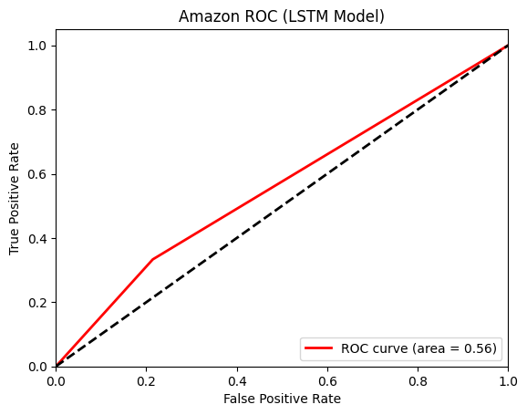
   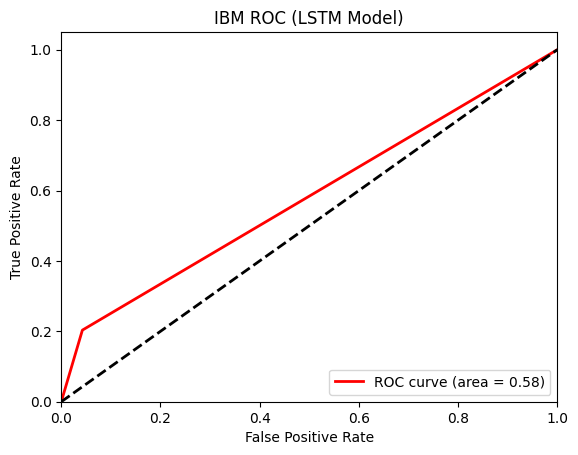
   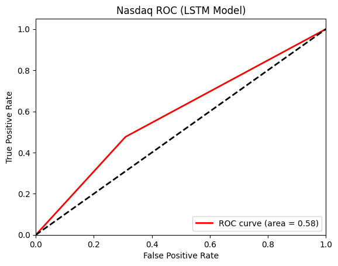

The confusion matrices offer deeper insights into the predictive behavior of our models on a more granular level. For instance, the model has shown a conservative behavior in market entry decisions for IBM - entering the market only 19 times, slightly less conservative for Amazon, and considerably aggressive for Nasdaq. 

   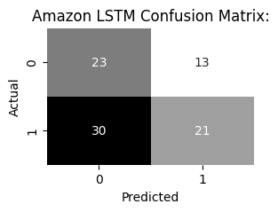
   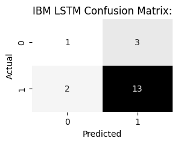
   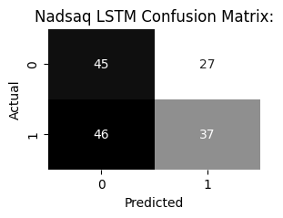

The more conservative strategy had for IBM paid off giving the best results.

### SVM

The SVM model demonstrates a slight improvement over previously tested models, achieving consistent accuracy levels around 53% across various stocks, with the exception of IBM. This suggests a marginal but notable enhancement in the model's learning capability.
- **Amazon accuracy**: 0.58
- **CAC accuracy**: 0.41
- **IBM accuracy**: 0.54
- **Microsoft accuracy**:0.57
- **SP500 accuracy**: 0.55
- **Nasdaq accuracy**: 0.54

These ROC curves illustrate the trade-off between sensitivity and specificity for three example stocks.

   
   
   

The confusion matrices offer deeper insights into the predictive behavior of our models on a more granular level. For instance, the model has shown conservative behavior in market entry decisions for IBM - entering the market only 13 times, slightly less conservative for Amazon, and considerably aggressive for Microsoft. 

   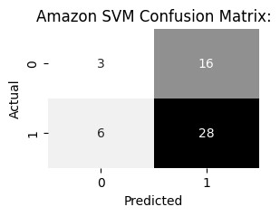
   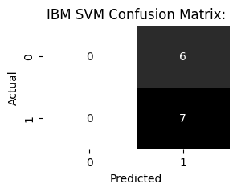
   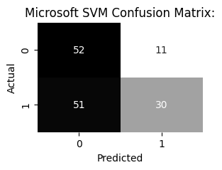

The model has opted for going long most of the time for Amazon and IBM, while instead has been bearish for Microsoft.

### Random forest

After analysing each model, we merged the results with a Random Forest which takes in input the trading signal of the three models and returns the final decision strategy. Also in this case, the results tell us that the accuracy is around 50%, so, for example, less than the average accuracy of LSTM and SVM. From the combination of the results of the different models we might have expected better results, but this is not reflected in the even worse accuracy compared to the previous models. 
- **Amazon accuracy**: 0.52
- **CAC accuracy**: 0.49
- **IBM accuracy**: 0.52
- **Microsoft accuracy**:0.48
- **SP500 accuracy**: 0.52
- **Nasdaq accuracy**: 0.52

### Benchmarking

Going forward we compared our results to a model that predicts only 1, so when the market goes long. As can be seen from the image, the accuracy is over 50% for each index and stock, emphasising the consistency of the results, thus producing a better result than the random forest on average.
- **Amazon accuracy**: 0.51
- **CAC accuracy**: 0.56
- **IBM accuracy**: 0.54
- **Microsoft accuracy**:0.55
- **SP500 accuracy**: 0.55
- **Nasdaq accuracy**: 0.54

### Summary

These aspects bring us to the realization that achieving perfect predictions in financial markets is inherently challenging due to the multifaceted nature of market dynamics. While our models exhibit an accuracy of around 50%, which indicates their effectiveness to some extent, it's crucial to acknowledge the limitations imposed by the complexity and unpredictability of market behavior. Despite the combination of results with a random forest model, it is evident that a holistic approach incorporating other factors in addition to price data is required to obtain more accurate forecasts.

## [Section 5] Conclusions

- Overall, we anticipated that achieving perfect models capable of accurately predicting the complexities of the stock market would be challenging, given the myriad variables influencing it. Beyond market volatility, which already poses a significant challenge, factors such as economic, political, social, and psychological elements are not inherently captured by models relying solely on financial data.

- Looking ahead, enhancing these models involves deepening their understanding of the stock market, encompassing both dynamic and financial perspectives. This expansion enables the models to forecast based on critical insights that highlight market context and its intrinsic characteristics, which are often obscured by price data alone.

- To conclude, the concept of the caotic system in the context of the stock market becomes relevant given the unpredictability of market dynamics. Even having a model that would predict perfectly the market, in a long-range distance the accuracy wuold back to medrioce values.

